# Probe

When we run the executable, It gives instructions about how to play, and the game begins as we press any key.

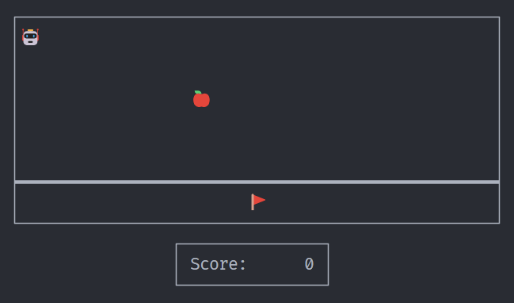

The game starts with a `9x25` grid, which has a player at `(0, 0)` and a flag at the middle of the last row, Obvious thing to do would be to move the character to the flag, but if we try to go there, sometimes, It'll just randomly stops at random cells, If we get lucky and get close to flag, there is a barrier on the row just above the flag which won't allow us to get there.

So to get to the flag we need to figure out how to disable that barrier and find out why we lose the game if we go to certain blocks.

Opening the binary in ghdira, we can see a lot of functions.

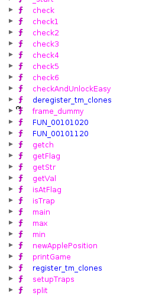

A few of the functions that stand out are `checkAndUnlockEasy` (there is an easy version of this game?), `isTrap` (there are traps?), `getFlag` (just reversing this function should be enough?).

Let's look at the main function.

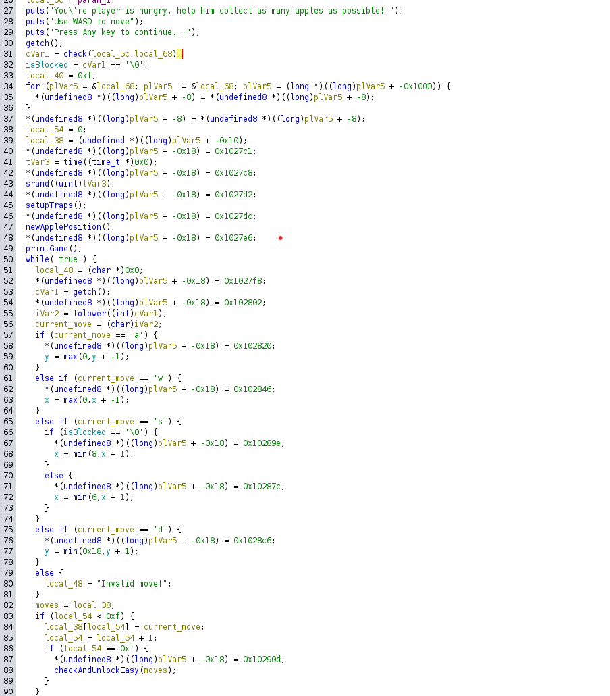

If we look at lines 31 & 32 we can see, there is a call to the `check` function, that has `argc` and `argv` command line arguments of binary as a parameter, and the return value is used to set `isBlocked` function, if `check` returns `true` then `isBlocked` is set to `false`, as we didn't pass any argument it probably didn't pass the check. We got `isBlocked` to `true`, this is likely the reason why there is a row blocked, but let's check further.

After that, we have lots of setting up game stuff such as `setUpTraps`, `newApplePosition`, and `printGame`. in the `while` loop, we can see we take input and move the position of the character, `x` and `y` seem to be a global variable that decides the position of the player. We can also see from lines 82 to 90 that we keep track of initial moves, the first 15 to be exact, and when we have 15 moves, we pass it to the `checkAndUnlockEasy` function, which probably unlocks the easy version of the game.

After that there is nothing much in the `main` function, there is a check if we captured the apple, or if we reached to flag (using `isAtFlag` function), If we reach the flag, it calls `getFlag` function with `argv[1]` as a parameter.

Let's see why we have a horizontal line before the row with the flag in the `printGame` function.

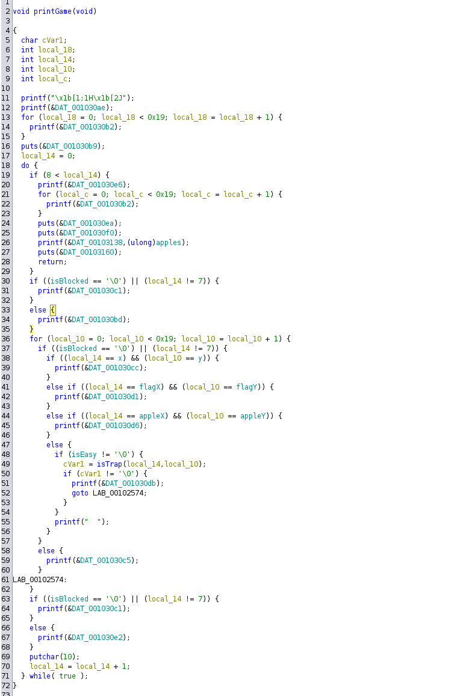

It mostly consists of printing stuff related to the game, such as showing the grid (from 36 to 62), if we check, we can see `isBlocked` is used to block the row with index `7`. So to get rid of that barrier we just have to set `isBlocked` to `false`, which means passing the `check` function that we saw earlier.

Another thing seems important is `isEasy` variable, if it's `true` (non-zero) then it checks if there is a trap (using `isTrap` function) and draws the different character, otherwise, it prints space there. so to view the traps we need to set `isEasy` function to `true`! we have already seen `checkAndUnlockEasy` function which is probably useful here.

Let's first focus to get rid of barrier. we know we have to pass a check in the `check` function, which takes command line arguments as parameters.

## Check function

Let's view the `check` function. After renaming few variables it looks something like this.

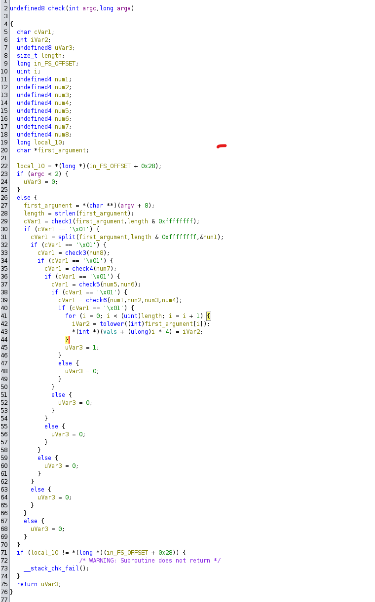

As we can see we are looking for at least one command line argument, and that is the only argument that is referenced in this function. that argument and it's length is passed to `check1` function, the `check1` function is simple and checks if length of the argument is exactly `32` and each character of the argument is hexadecimal digit (i.e., 0-9,A-F,a-f). So our argument needs to be 32 length hexadecimal string.

If `check1` passes we call `split` function with same parameter but this time we also pass address of `num1` variable, let's check the `split` function.

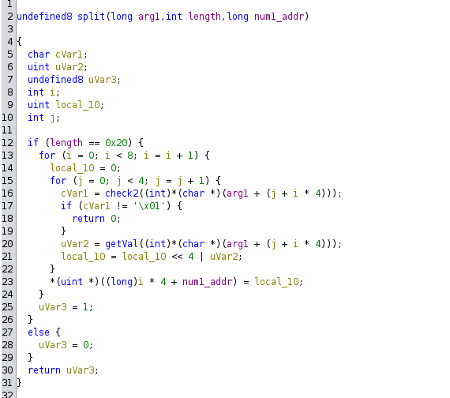

The function is short and simple, it first checks for length again (32 that is), and after that there are two loops, it processes 32 characters in the group of fours. we can see each characters goes through `check2` which once again check if character is hexadecimal, after that there is call to `getVal` that returns decimal value of that hexadecimal character. we basically calculate decimal value of characters in group of four, and store it at `num1_addr`, we know `num1_addr` is address of `num1`, but `num1_addr` is treated as array of 8 integers, hence the value filled at `num1_addr` will affect, all 8 variables, `num1`, `num2`, .., `num8` that we saw on `check` function.

So the summary of the split function, say the input was a string of 32 lengths "`aaaabbbbccccddddeeeeffff11112222`", then

```txt
num1 = 0xaaaa
num2 = 0xbbbb
num3 = 0xcccc
num4 = 0xdddd
num5 = 0xeeee
num6 = 0xffff
num7 = 0x1111
num8 = 0x2222
```

### Num8

Going back to `check` function, we have a `check3` for `num8`. which is simply checks if msb of `num8` is at 15th position (zero indexed), after that it checks if the number is one of the fibonacci number starting from two ones, (1, 1, 2, 3, ..), we know fibonacci number approximetely doubles itself of last number (1.618033 times last element), because of that luckily there is exactly one fibonacci number with msb at 15th position, we can find it using following code.

```py
i = 1
j = 1

while True:
  k = i + j
  
  # fifteenth bit is msb so it has exactly 16 bits
  if len(bin(k)[2:]) == 16:
    print(k)
    break
  
  i = j
  j = k
```

This give `0xb520` as output so now we know, `num8 = 0xb520`.

### Num7

Next in `check` function, we have `check4` for `num7`, let's look at `check4`.

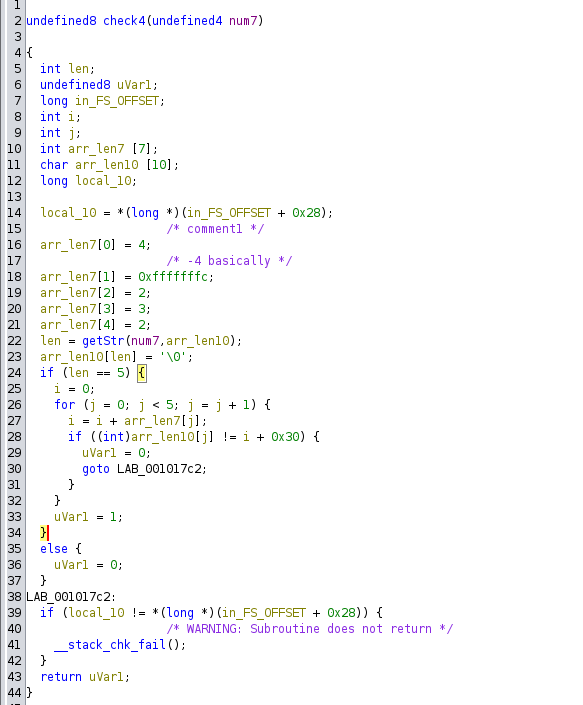

It makes array of length 7 and stores numbers like [4, -4, 2, 3, 2], it also calls `getStr` with `num7` and `arr_len10` as parameter, if we check `getStr` we can see that it just modifies the `arr_len10` to `num7` as a character array/string (similer to `to_string` in c++) and returns number of digits in `num7`, so now we have string version of `num7`, as we can see it should be exactly five decimal digits, and after that there is a check for each of the digit of `num7`, the check simply makes a prefix sum array of `arr_len7`, and checks if it matches with corresponding character in `arr_len10`.

The prefix sum array of `arr_len7` is `[4, 0, 2, 5, 7]`, which in decimal will be 40257, so `num7` is 40257, which converted to hexadecimal is `0x9d41`

### Num5 and Num6

Next in `check` function is call to `check5` with `num5` and `num6` as argument. the `check5` function is simple and just checks if `num5` equals to `0x1750` and `num6 ^ num5 = 0x935d`.

Therefore `num5` is `0x1750` and `num6` = `0x935d^0x1750` = `0x840d`.

### Num1, Num2, Num3, Num4

Last check in `check` function is call to `check6` which takes rest of the number as parameter. Let's look at `check6`.

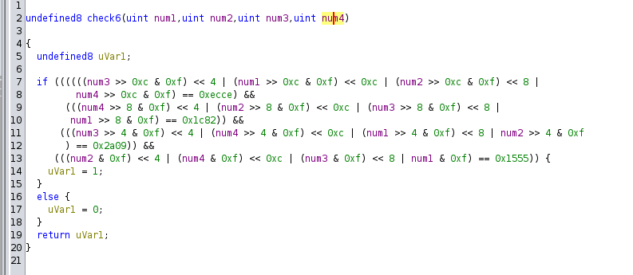

We know `num1`, `num2`, `num3` and `num4`, all have exactly 4 hexadecimal digits, this function simply rearranges those digits at all 4 different position and checks them. for example in the first condition. it finds the first digit of `num3`, `num1`, `num2`, `num4`. concatenates them in an order and compares with `0xecce`. so we know, first digit (from left) these number are..

```txt
num3 = 0xcxxx
num1 = 0xexxx
num2 = 0xcxxx
num4 = 0xeXXX
```

in similer manner we check for the rest of the bits. after getting rest of the digits, we'll have,

```txt
num1 = 0xe2a5
num2 = 0xc195
num3 = 0xcc05
num4 = 0xe821
```

## Bypassing the block

We now have all the number from `num1` to `num8`, concating them in this order will give 32 character long string that would pass the `check` function and should be able to unblock the barrier. It should work with both upper and lower case characters.

`input: e2a5c195cc05e8211750840d9d41b520`

After passing this as argument to the binary we'll get game something like this.

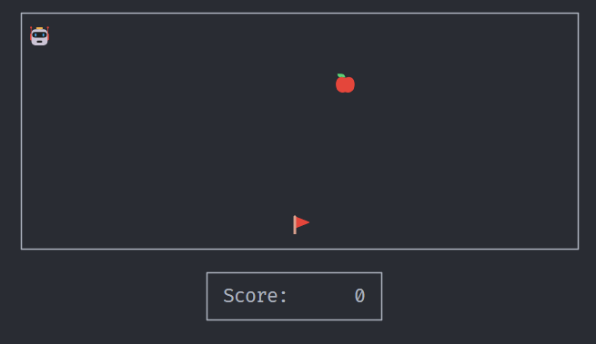

Now we are free to go flag, but still there would be cells that if we step on it the game stops, let's find those out, as we saw on `printGame` function, those cells are built into game and if `isEasy` is set to `true` they would be visible (by using different character than space). We also saw a function `checkAndUnlockEasy` which was called when we complete the first 15 moves in the game, let's take a look.

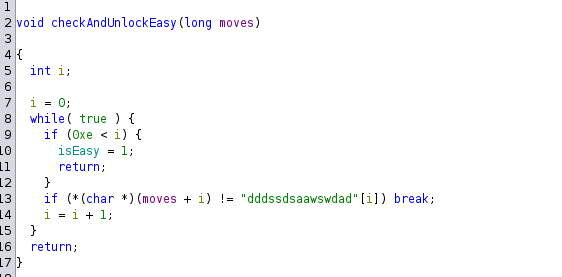

Function is easy enough, it just checks the first 15 moves, and sets `isEasy` to `true` if we match the required moves. The required moves are `dddssdsaawswdad`.

Let's use these as first 15 moves and see what happens.

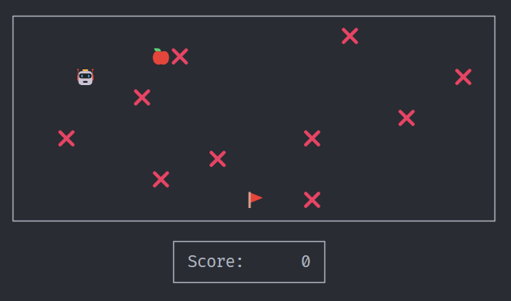

We unlocked all the traps! Now we should be able to get to flag without encountering the trap, right?

If we try to get to flag's position the flag will just move away, we know from the `main` function that when we have a check called `isAtFlag` whenever we make a move, let's check the function and see what happens when we get there.

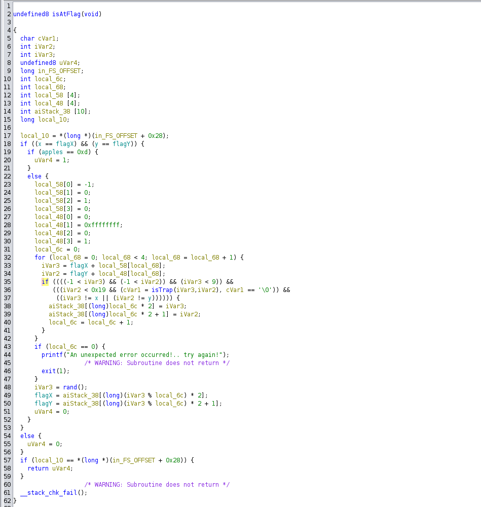

From the function it's clear what happens, when we get to flag position and we have exactly `0xd (13)` apples, it returns `true`, which in return will call `getFlag` function, but if we don't have 13 apples, it just moves the flag to neighbouring cells.

Let's play the game again with unblocking the row, unlocking the traps, and after collecting exactly 13 apples we should be able to capture the flag!

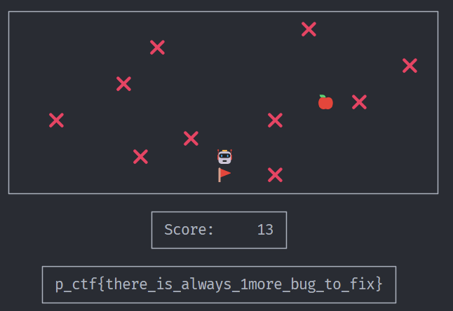
