# Writeup

We are given a capture.pcapng. To gather more information about the file, we open it up in Wireshark. We find an FTP stream and follow it. 

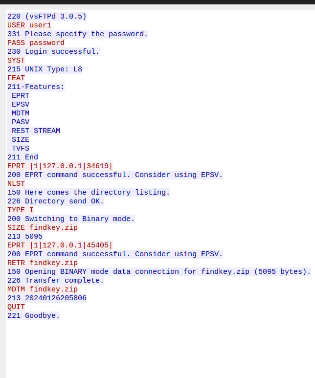

We follow the FTP-DATA packet and extract the findkey.zip.

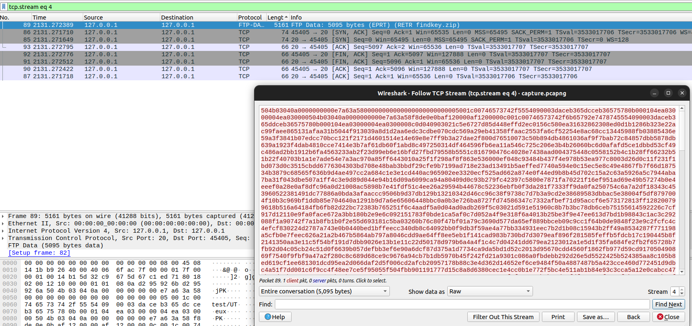

```bash 
unzip key.zip
```
We get a test directory with a key.txt which seems to be encrypted. Searching through the packets, we find one packet with the following comment:

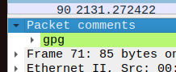

```bash
gpg -d key.txt
```
GPG (Gnu Privacy Guard) is a free and open-source encryption software used for secure communication and data protection. It employs asymmetric cryptography, allowing users to generate key pairs for encryption and decryption. GPG supports various encryption algorithms and provides digital signatures for verifying the authenticity of messages and files.

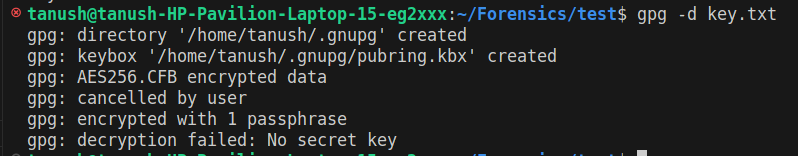

We need a passphrase to open this file... Now onto the next section of the challenge. From the hint in the challenge ``where the very essence of ports became enigmatic`` means that we have to use ports somehow. The use of ``Irony Seas``
and ``Isle of paradox`` we infer that there might be some element of false information in the challenge. Now, analyzing the UDP packets, the first packet we come across has some useful info.

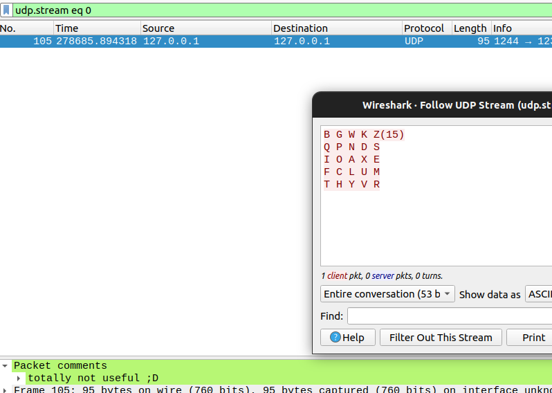

The arrangement of the 25 letters suggests a grid-like structure, indicating a systematic organization. By analyzing this structure, according to Z(15) we can infer that each letter corresponds to a unique pair of coordinates within the grid. This observation leads to the concept of a Polybius Square, a grid-based encryption technique often utilized in cryptography for encoding and decoding messages.

The next 100 packets look like and are of the actual flag format having some random strings in it. Judging the ironical theme of the challenge we ignore these flags.

After this though we get these packets as we filter 

```query
udp.stream ge 101
```
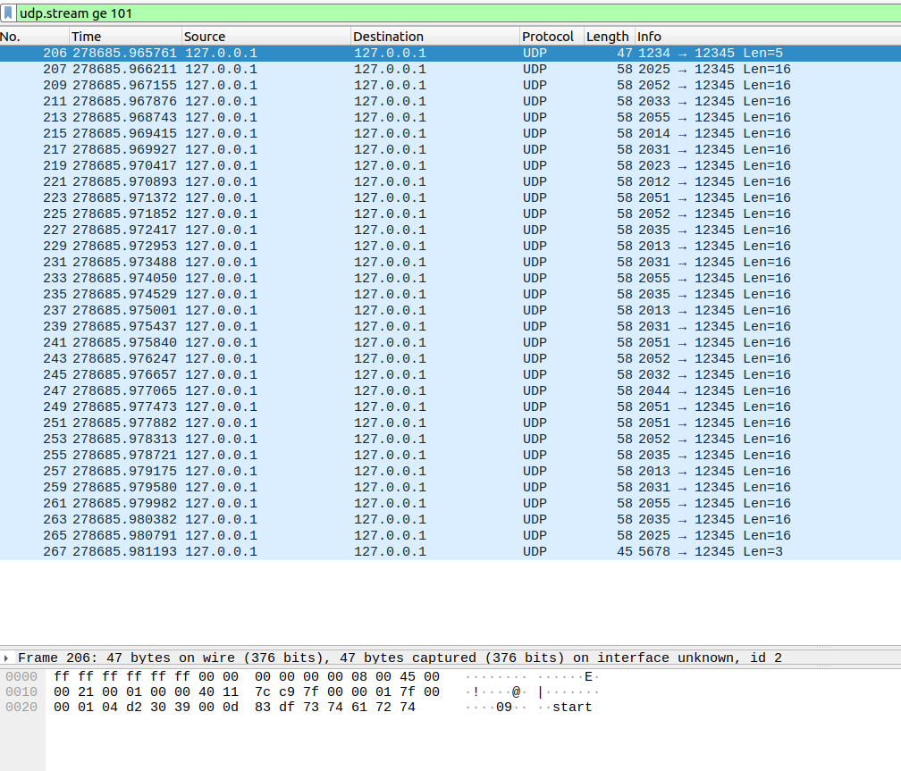

Which has a start packet then followed by some packets having data as ``ThisisNoTTheflag``... and ends with an end packet.
Having a proper understanding of the challenge description we see that we have to use the ports of these packets and use **Bifid Cipher** (This can observed as the first 2 digits being a constant->20 and the last 2 digits of the ports of these packets satisfy the grid co-ordinates.) on it to proceed further in the challenge.

Looking at how the Cipher works on Wikipedia we take the co-ordinates and encrypt it using the following script 

```python
def coordinates_to_letters(polybius_square, coordinates):
    result = ""
    for i in range(0, len(coordinates), 2):
        x_coord = int(coordinates[i])
        y_coord = int(coordinates[i + 1])
        
        if 1 <= x_coord <= 5 and 1 <= y_coord <= 5:
            result += polybius_square[x_coord - 1][y_coord - 1]

    return result

polybius_square = [
    ['B', 'G', 'W', 'K', 'Z'],
    ['Q', 'P', 'N', 'D', 'S'],
    ['I', 'O', 'A', 'X', 'E'],
    ['F', 'C', 'L', 'U', 'M'],
    ['T', 'H', 'Y', 'V', 'R']
]

# Output coordinates inferred using ports
output_coordinates = "253513215531353135534555313532523541321253155311224112531555"

decoded_string = coordinates_to_letters(polybius_square, output_coordinates)

print(decoded_string)
```

```bash
python3 bifid.py
```
we get the output ``SEWQRIEIEYMRIEOHEFOGYZYBPFGYZR``

Using this as the passphrase for the key.txt we found from the zip, we successfully decrypt it!

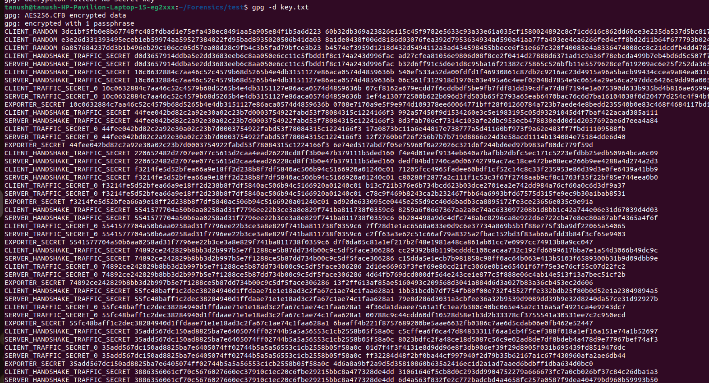

```bash
 gpg -d key.txt > key.log
```

Opening this log we search about this data we observe that it seems like a SSLKEYLOGFILE for TLSv1.3.We decrypt the TLS streams using the following the steps.

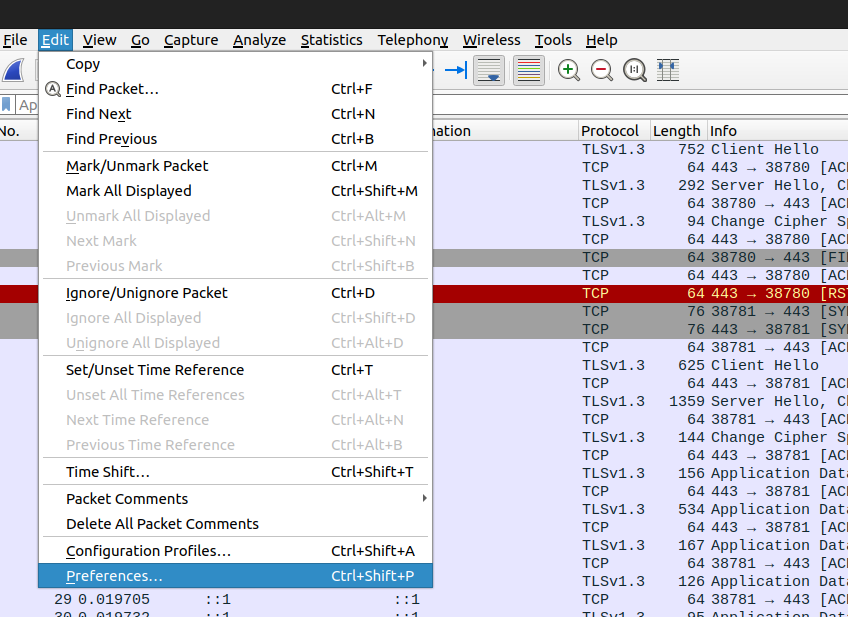


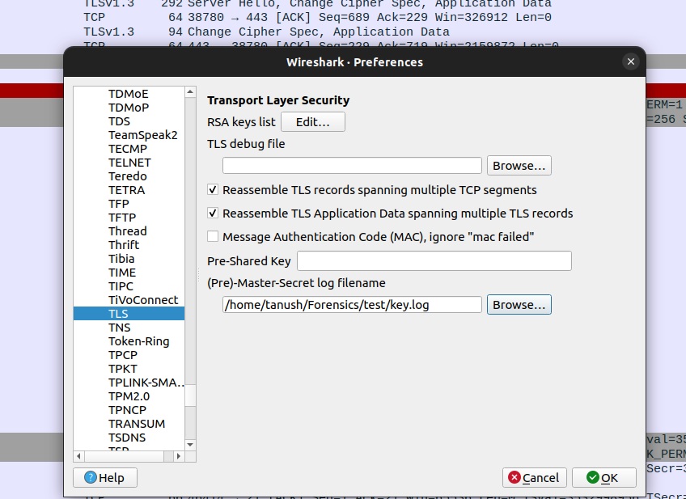

We obtain some HTTP packet exchange.

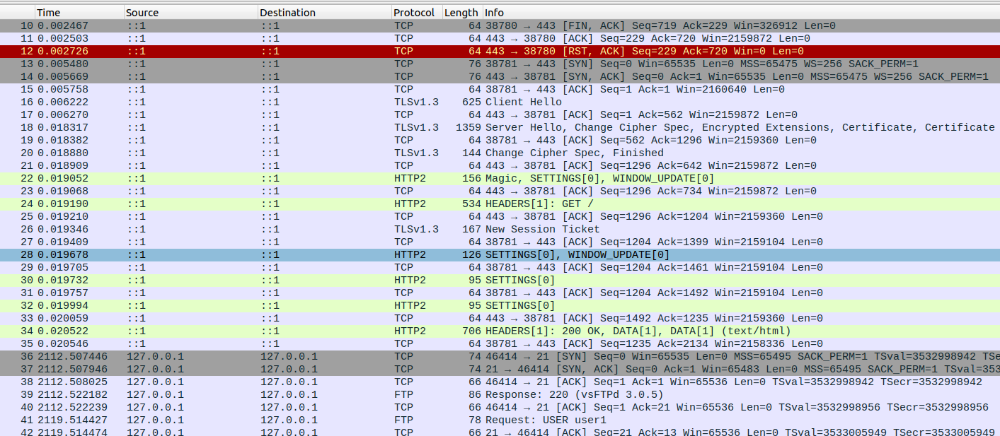

Following one of the HTTP streams we find the flag:-

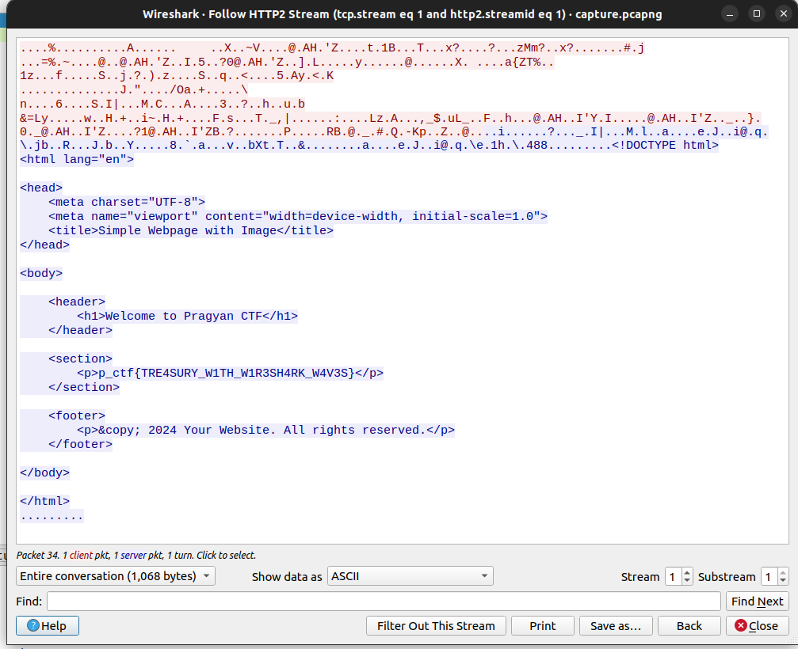
