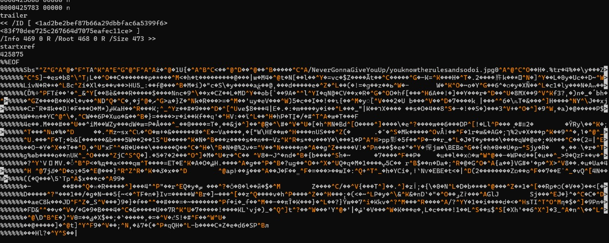
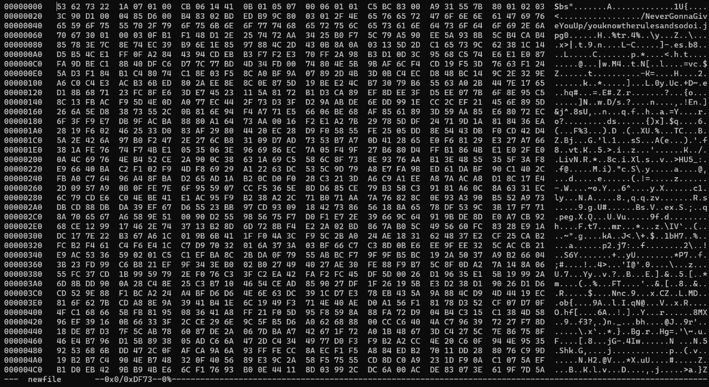
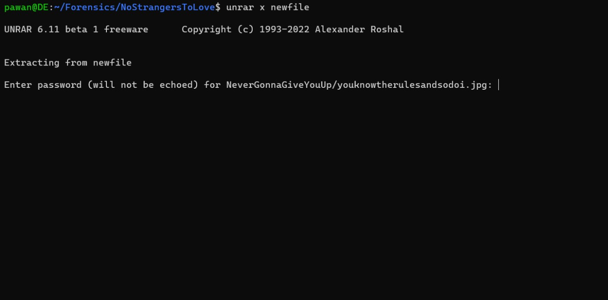
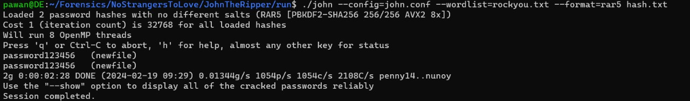
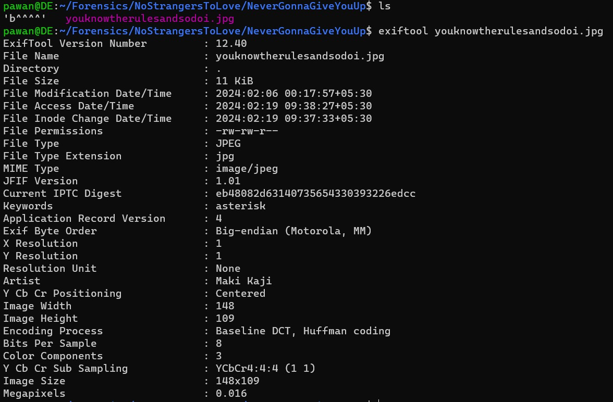
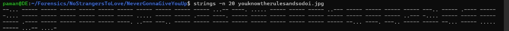
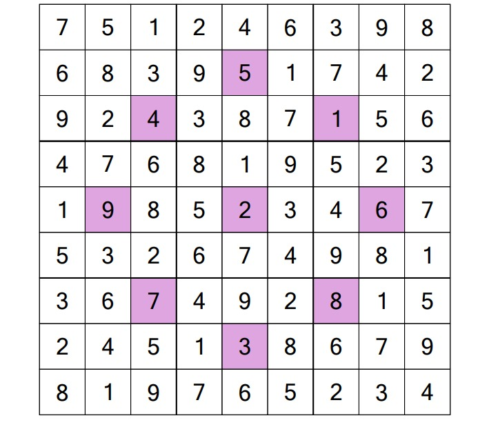
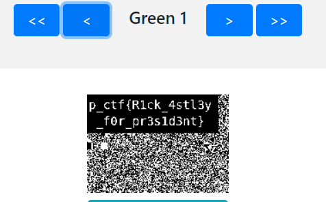

# Writeup

We are given a rickroll.pdf. To gather more information about the pdf, we open it up in a text editor. We find suspicious data at the end of the file.


We extract it. 
```bash 
tail -n 234 rickroll.pdf | sed -e 's/^%%%%%%//' > newfile
```



```bash
file newfile
```
gives us ``newfile: data`` as output. It looks like a corrupted archive. This means we'll have to look into the file signatures. Looking through wikipedia we stumble across rar5 header ``52 61 72 21  1A 07 01 00``  which resembles 
the one which is corrupted. We change it and use the following command to extract it:

```bash
unrar x newfile
```


Seems to be password protected. Either we missed somewhere in the pdf or it has to be brute forced. The second option is always better to do first.

```bash
rar2john newfile > hash.txt
john --config=john.conf --wordlist=rockyou.txt --format=rar5 hash.txt
```


we get the password to be ``password123456``. Extracting the files we get 2 files. We analyze the ``youknowtherulesandsodoi.jpg`` image

```bash
exiftool youknowtherulesandsodoi.jpg
```


We get two important peices of information here. The artist is specified as **Maki Kaji** who is the founder of sudoku and there is a Keywords section having **asterisk** as well. 

```bash 
strings -n 20 youknowtherulesandsodoi.jpg
```


Running strings on the file we get a morse code which on decoding we get ``700000000003950002000080106000000500190000000002600001000092800000000079800705034`` -> an 81 number string which shows it is a valid **asterisk sudoku**.



We get the above solved sudoku. 

Now we look at the other file ``b^^^^``
```bash
file b^^^^
```
gives us ``b^^^^: data`` as output. looking at the filename itself we are hinted that we have xor it with something. Taking the asterisk string frm the sudoku and trying using this script:

```python
input_file = 'b^^^^'
output_file = 'xored.png'
key = b'541926783'

with open(input_file, 'rb') as f:
    data = f.read()

xored_data = bytes([b ^ key[i % len(key)] for i, b in enumerate(data)])

with open(output_file, 'wb') as f:
    f.write(xored_data)

print(f"XORed data written to {output_file}")

```


We get our final image. As the hint the question description ``At the end of your journey, recall the planes of existence you've traversed; therein lies the answer.`` hints at browsing bit planes, we browse all the bit planes and get our flag in one of them 


