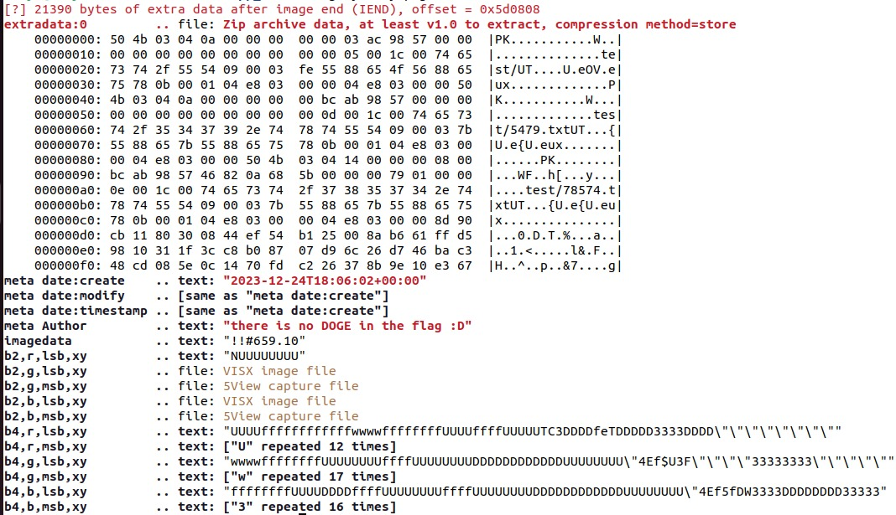
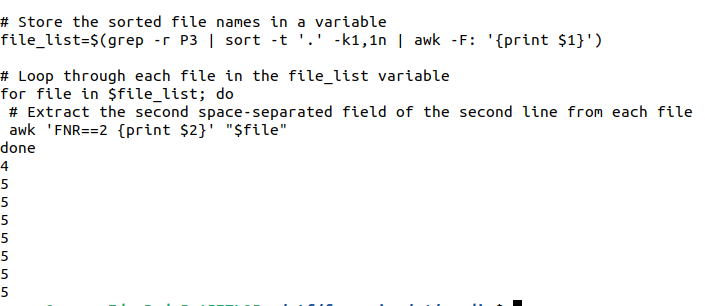

# Writeup

We were given an image of the octagon at NITT. To gather more information about the image, we utilized a steganography detection tool called `zsteg`:

```bash
zsteg mystery.png
```


From the analysis, we obtained the following output:

Inside the image, we discovered a zipfile. Upon extracting it, we obtained a directory named test containing multiple text files. Considering the hint from someone named Stella and the Octagon photo, we inferred that it referred to **Stella Octangula Numbers**. Utilizing this clue, we extracted all the text files that matched this sequence into a new directory using the following script:
```
#!/bin/bash

mkdir -p ../newdir

file_count=$(ls -l | grep ".txt" | wc -l)

# Move files named according to the pattern to the new directory
for ((n=0; n<file_count; n++))
do
 A=$((n*(2*n*n-1)))
 file="${A}.txt"

 if [ -e "$file" ]; then
 mv "$file" ../newdir
 fi
done
```
Delving into the Environmental Conundrum and researching the peculiar headers of some text files, we discovered they were in the **PPM (Portable Pix Map)** image format. These headers contain details about the size and number of pixels in the image. Since only a few files had headers, we concluded that merging images was necessary for further progress.
```
#!/bin/bash

# Store the sorted file names in a variable
file_list=$(grep -r P3 | sort -t '.' -k1,1n | awk -F: '{print $1}')

# Loop through each file in the file_list variable
for file in $file_list; do
 # Extract the second space-separated field of the second line from each file
 awk 'FNR==2 {print $2}' "$file"
done
```
The output provided us with the number of images to be merged, in order:


Upon further investigation and experimentation with merging, we discovered that there was only a need to append the text files. We used the following script to append them:
```
#!/bin/bash

# Output of the previous script
output='4
5
5
5
5
5
5
5'

# Store text files in an array and sort them
files=($(ls | grep '.txt' | sort -t '.' -k1,1n))
start=0
index=0

for count in $output; do
    for ((i=0; i<count; i++)); do
        # Concatenate each line of the file to start.ppm
        while IFS= read -r line; do
            echo "$line" >> "${start}.ppm"
        done < "${files[index]}"

        # Append a newline if it's not the last line in the last file
        if [[ $index -ne $((${#files[@]} - 1)) ]]; then
            echo >> "${start}.ppm"
        fi
        ((index++))
    done
    ((start++))
done
```
Executing this script will generate 8 .ppm images, leading us to the flag.


