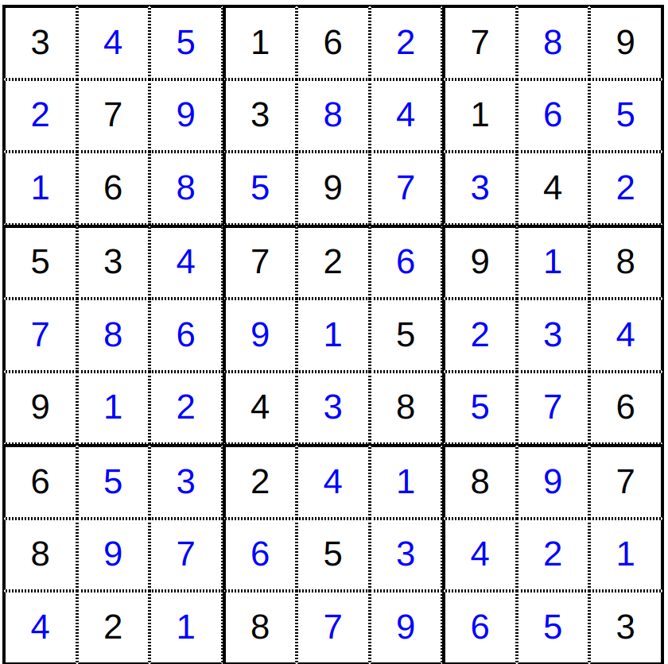

# Bruteforce

## First Part

On first glance, we are given the ciphertext and told to find the corresponding plaintext. 
The encryption algorithm used is AES-ECB, which is encrypted block by block independently from each other.

There are a total of 95 characters (alphabets, digits, punctuation and space) that can be a part of the block. 
Since each plaintext block consists of 16 characters, there are 95^16 different combinations for each block. which is infeasible to solve within the time of the CTF. 

Hence we need to look for more clues. Looking at the [Newspaper.pdf](includes/Newspaper.pdf) that was given, we can find an encrypted text in some unknown cipher

```
Qtyytxtz id xklepjk oazna’m iwttsd mcsrxi, iivv glf pqz xiymy ngq uvsiot-cond xcbo iiie lntyc - hvlwkgxwsughe haehqagzsmzyc.
```

Looking around for more clues in the newspaper, we find a Sudoku puzzle. Running the Sudoku puzzle through an online Sudoku solver, we get a solution
 

The solved sudoku puzzle resembles a 9x9 Matrix and since the middle cell is highlighted in grey, we can assume that we have to use just that 3x3 Matrix. 
The most common cipher that use matrices as keys is [Hill cipher](https://en.wikipedia.org/wiki/Hill_cipher).

Considering standard Hill Cipher, you also need to make sure that your matrix Key is invertible mod 26. You can also verify that the entire 9x9 matrix is not invertible mod 26, whereas the middle 3x3 matrix is. 

Using [ [7 2 6], [9 1 5], [4 3 8] ] as the key, you can use an online tool like [Dcode](https://www.dcode.fr/hill-cipher) to decrypt the ciphertext from the newspaper.

```
Congrats on solving today's magic square puzzle, here are the first few characters of the each block - hidinginsaint kittsisnotbad
```

## Second Part
From the first part, we now know that there are just 2 blocks in the password and we know the first 13 characters of each block.

The first block must contain 16 characters for sure so the number of possible combinations to bruteforce for is now down to `95^3`.

The second block can contain either 14 or 15 characters. If you refer to the [PKCS padding method](https://www.ibm.com/docs/en/zos/2.4.0?topic=rules-pkcs-padding-method), you will find that if the number of characters in the plaintext is divisible by 16, then the last block will be padded with 16 `0x10` bytes to indicate last block.
If the second block had 16 characters, then after the padding the block would have 32 characters, 16 characters from the plaintext and 16 characters from padding. Hence after encryption with AES, there would have to be three blocks in the ciphertext but there are only two. Hence the second block cannot have 16 characters. Therefore, number of combinations possible for second block is `95 + 95^2`.

This reduces the number of possible combinations to bruteforce down to `95 + 95^2 + 95^3 = 866,495` for the first block and second block.

`866,495` combinations is possible to bruteforce but considering network delays, it would take hours to bruteforce one by one.

Hence we need to send multiple plaintexts at once and receive multiple plaintexts from the service and verify to reduce the number of request to and from the service.

You can find that the maximum number of plaintexts you can send at a time is 100
```
> nc brute.ctf.pragyan.org 50336
Welcome to PassionFruit Inc.'s premium service to encrypt text using AES-ECB

Enter text to encrypt using PASSION as a separator:
aPASSIONaPASSIONaPASSIONaPASSIONaPASSIONaPASSIONaPASSIONaPASSIONaPASSIONaPASSIONaPASSIONaPASSIONaPASSIONaPASSIONaPASSIONaPASSIONaPASSIONaPASSIONaPASSIONaPASSIONaPASSIONaPASSIONaPASSIONaPASSIONaPASSIONaPASSIONaPASSIONaPASSIONaPASSIONaPASSIONaPASSIONaPASSIONaPASSIONaPASSIONaPASSIONaPASSIONaPASSIONaPASSIONaPASSIONaPASSIONaPASSIONaPASSIONaPASSIONaPASSIONaPASSIONaPASSIONaPASSIONaPASSIONaPASSIONaPASSIONaPASSIONaPASSIONaPASSIONaPASSIONaPASSIONaPASSIONaPASSIONaPASSIONaPASSIONaPASSIONaPASSIONaPASSIONaPASSIONaPASSIONaPASSIONaPASSIONaPASSIONaPASSIONaPASSIONaPASSIONaPASSIONaPASSIONaPASSIONaPASSIONaPASSIONaPASSIONaPASSIONaPASSIONaPASSIONaPASSIONaPASSIONaPASSIONaPASSIONaPASSIONaPASSIONaPASSIONaPASSIONaPASSIONaPASSIONaPASSIONaPASSIONaPASSIONaPASSIONaPASSIONaPASSIONaPASSIONaPASSIONaPASSIONaPASSIONaPASSIONa
Only 100 inputs at once
Enter text to encrypt using PASSION as a separator:
```

Hence we shall send 100 plaintext combinations per block and receive 100 ciphertext combinations and compare with the ciphertext given in the question. If it matches, then we found the right combination.

Using pwn, we shall connect to the server and bruteforce every possible combination based what we found earlier.

```python
from pwn import *
import string

chars = string.ascii_letters + string.digits + string.punctuation + " "

if not sys.warnoptions:
    import warnings
    warnings.simplefilter("ignore")

ct = "3241bb91577091d488a49e81fe6332a6c2580a3241d1289f9e03b0ef02e1bb2b"
first_chars = ["hidinginsaint", "kittsisnotbad"]

conn = remote("brute.ctf.pragyan.org", 50336)
conn.recvuntil(':')

final_blocks = []
batch = []

def get_from_server(pt):
    conn.sendline(pt.encode())
    return conn.recvuntil(":").decode().splitlines()[1:-1]

def bruteforce(ct):
    blocks = list(map(''.join, zip(*[iter(ct)]*32)))
    n = len(blocks)
    for i in range(n):
        print(i)
        def is_same(str, block = blocks[i]):
            batch.append(first_chars[i]+str)
            if len(batch) == 100:
                sentence = "PASSION".join(batch)
                encrypted_blocks = get_from_server(sentence)
                if i!=(n-1):
                    encrypted_blocks = [ encrypted_block[:32] for encrypted_block in encrypted_blocks ]
                    
                if block[:32] in encrypted_blocks:
                    final_blocks.append(batch[encrypted_blocks.index(block[:32])])
                    batch.clear()
                    return True
                batch.clear()
            
        if i==n-1:
            pwnlib.util.iters.bruteforce(is_same, chars, 3, method='upto')
        else:
            pwnlib.util.iters.bruteforce(is_same, chars, 3, method='fixed')

def main():
    bruteforce(ct)
    print(final_blocks)
    print(f"Final password is {final_blocks[0]}{final_blocks[1]} ")
    conn.close()
main()
```

The above script should finish bruteforcing in less than 7 minutes (depends on your internet speed) and you will get this. 
```bash
[+] Opening connection to brute.ctf.pragyan.org on port 50336: Done
0
[+] Bruteforcing: Found key: "*(("
1
[+] Bruteforcing: Found key: "&N"
['hidinginsaint*(5', 'kittsisnotbad%!']
Final password is hidinginsaint*(5kittsisnotbad%! 
[*] Closed connection to brute.ctf.pragyan.org port 50336
```

That is the password so flag is `p_ctf{hidinginsaint*(5kittsisnotbad%!}`


