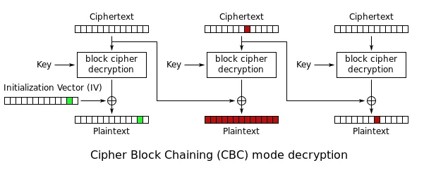

# Red Herring

## First Part
From the first clue, we know that we need to decrypt the given ciphertext to a different plaintext. Hence you can use bit-flip attack to change the plaintext during decryption.

 

If you look at the given plaintexts, you will notice that the characters at the end are unchanged.

    there aren't any RED herrings in this challenge. Do IT carefully.
    sadly, there are RED herrings in this challenge. Do IT carefully.

If you consider a block size of 128 bits, you notice that only the first block is changed. 

    there aren't any           -> 16*8 bits = 128 bits
    sadly, there are           -> 16*8 bits = 128 bits 

Hence, from diagram we can figure out that only the value of IV needs to be changed to produce a bit flip attack in the first block.

```python
def bit_flip(original, modified, iv):
    difference = [ord(a) ^ ord(b) for a, b in zip(original[:16], modified[:16])]
    return ''.join(["%0.2x" % (int(iv[i*2:i*2+2], 16) ^ difference[i]) for i in range(16)])


original_iv = "7e7d3b68214d2d403a533f246246525d"

# modifying the first block
new_iv = bit_flip("there aren't any",'sadly, there are', original_iv)
print("New IV = ", new_iv)
```
Output:

    New IV =  79743a763d416c4637586a3562464e41

Converting from hex to string, you get

    New IV = yt:v=AlF7Xj5bFNA

## Second Part
The New IV that you found looks very familiar to a YouTube link. On visiting [Link](https://www.youtube.com/watch?v=AlF7Xj5bFNA), you will find a video with a QR code which decodes to 
    
`Well done on solving the first clue. Here is the second clue: only one of the videos has a KEY in it. Solve the ciphertext.`

If you visit the YouTube channel, you will find 15 similar vidoes with QR codes and ciphertexts in description. After decoding each QR code and arranging them in chronological order of when the video was posted,

     1) SFE IFSSJOH
     2) TGF JGTTKPI
     3) UHG KHUULQJ
     4) VIH LIVVMRK
     5) WJI MJWWNSL
     6) XKJ NKXXOTM
     7) YLK OLYYPUN
     8) FWZ KQXXPMZ
     9) ANM QNAARWP
    10) BON ROBBSXQ
    11) CPO SPCCTYR
    12) DQP TQDDUZS
    13) ERQ UREEVAT
    14) FSR VSFFWBU
    15) GTS WTGGXCV
    
As you can see that there is a pattern formed where every message from the QR code seems to be shifted versions of the same message, except in the case of the 8th video. Another clue that 8th video stands out comes from the fact that when you Base64 decrypt all the descriptions, only the 8th video gives you bytes whereas everything else will give you in terms of characters.
After trying to decipher the ciphertext, we find that the shift used is the same as the order at which the videos was posted chronologically. Every QR decrypts to *RED HERRING* meaning those videos can be ignored as those videos were Red Herrings, which were meant to distract you.


But when we decrypt *FWZ KQXXPMZ* with a shift of *8*, we get

    XOR CIPPHER

We do not have the key to the XOR cipher used but from the second clue, we know that the word, **KEY** is there in the ciphertext. Hence we bruteforce XOR by changing the value of the XOR key, while the word **KEY** as crib. 

```python
from pwn import xor
import base64

ciphertext = b'FT4bCwgaAggHFgAWAxINEAUHGQoTEBQQDBUICBEADgYTEwUVGAUECBcOCwkcaycIDwANQQINFARbQTUJBEEHDQAGQQgSQQQPAhMYERUEBUEWCBUJQQBBAggRCQQTQShBCA8XBA8VBAVPQRQSBEEVCQRBDA4FCAcIBAVBKDdBABJBFQkEQSokOE1BCA9BFQQVEwASBBkABgQSCAwADUEHDhMMABVBFggVCQ4UFUERAAUFCA8GQQAPBUEPFAwDBBMSTUEVDkEUDw0OAgpBFQkEQQcNAAZP'

# cracking XOR by bruteforce 
for key in range(0,100000000000):
    m = xor(base64.b64decode(ciphertext), key.to_bytes(1, 'big'))
    if 'KEY' in m.decode():
        print(m.decode())
        break
```
Output:


    t_zji{cifwawbslqdfxkrquqmtiipaogrrdtydeivojh}
    Final clue: The flag is encrypted with a cipher I invented. use the modified IV as the KEY, in tetrasexagesimal format without padding and numbers, to unlock the flag.

## Third Part

If you look at the channel and reverse image search the channel logo, you will find out that *Blaise de Vigenère* is the inventor of *Vigenere cipher*. 

Hence first we need to make the modified IV in the form of a Vigenere key according to how the final clue wants us to solve.


Modified IV in tetrasexagesimal format or base64 is 
```
eXQ6dj1BbEY3WGo1YkZOQQ==
```
Removing special characters and numbers, we get
```
eXQdjBbEYWGoYkZOQQ
```

Size of the ciphertext: `t_zji{cifwawbslqdfxkrquqmtiipaogrrdtydeivojh}` is 45 characters (excluding special characters). So we need to increase size of the key to match size of ciphertext

```
vigenere key = eXQdjBbEYWGoYkZOQQeXQdjBbEYWGoYkZOQQeXQdjBbEY
```

Hence, decrypting the flag using the newly formed vigenere key using any online decryption service for Vigenere cipher, we get
Output:
```
The flag is p_ctf{thescavengerhuntendshereisthefinalflag}
```
