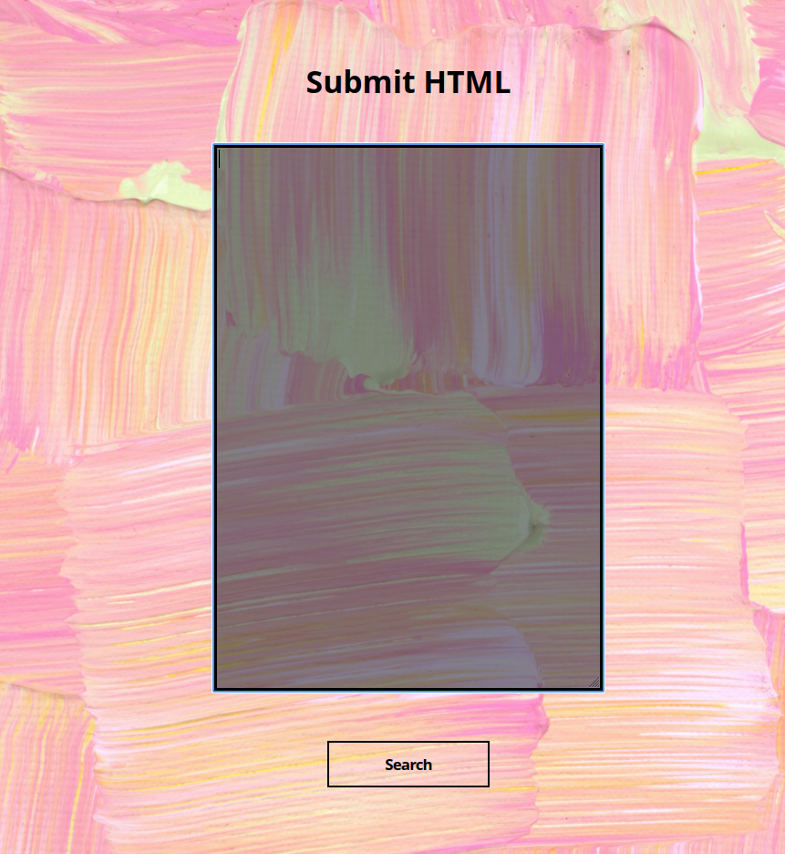
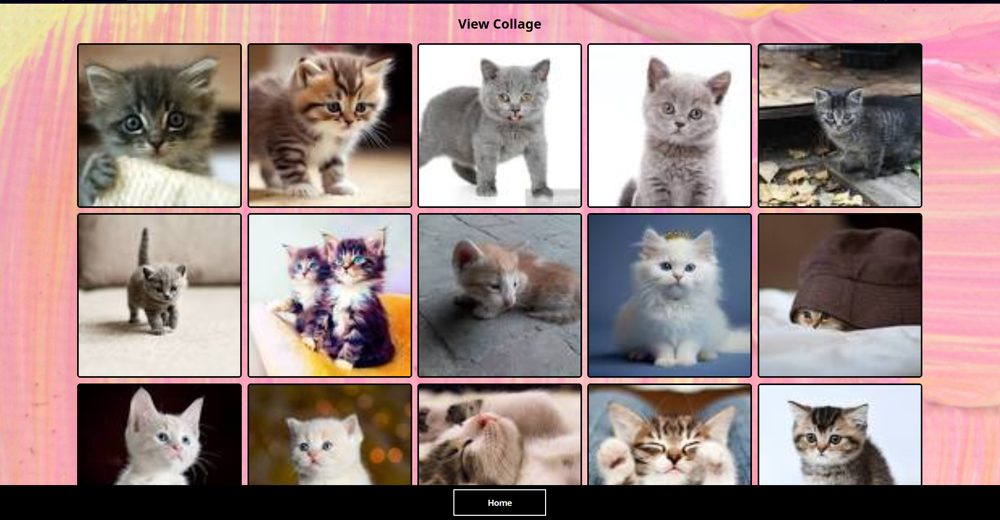
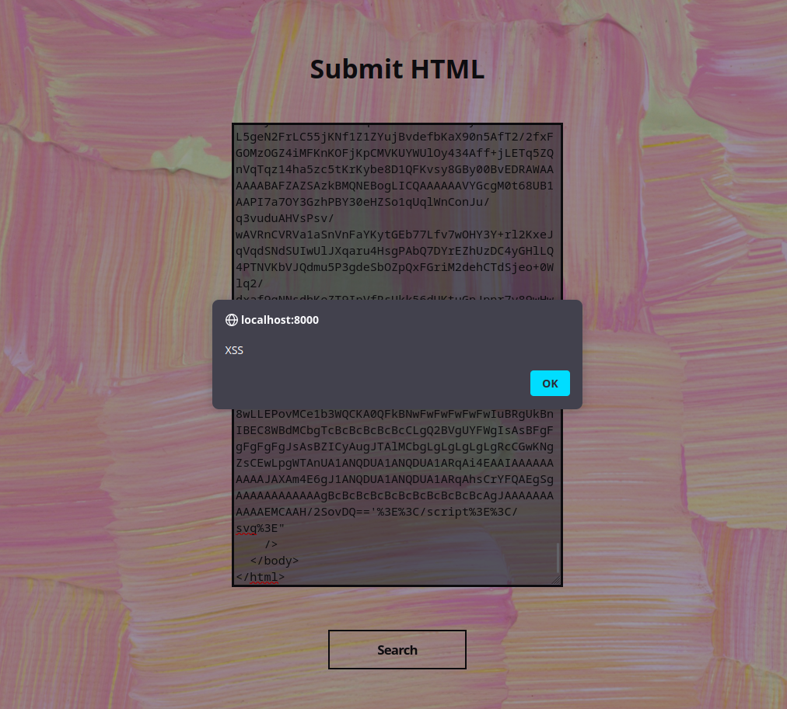
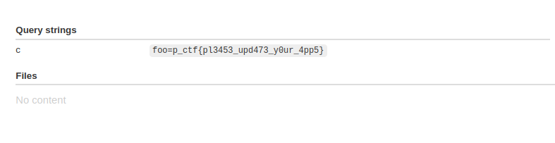
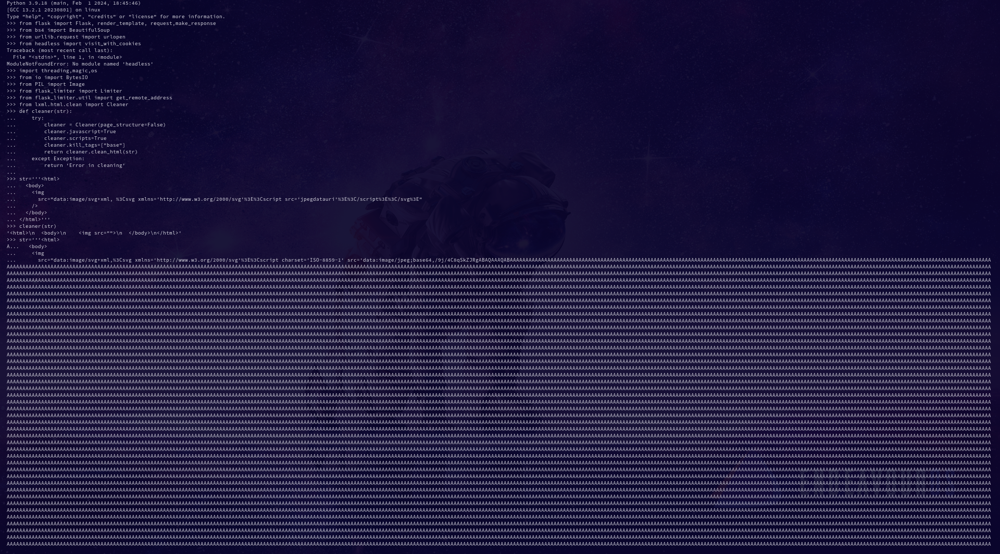
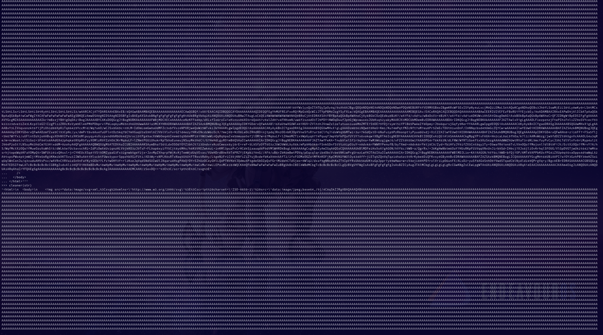
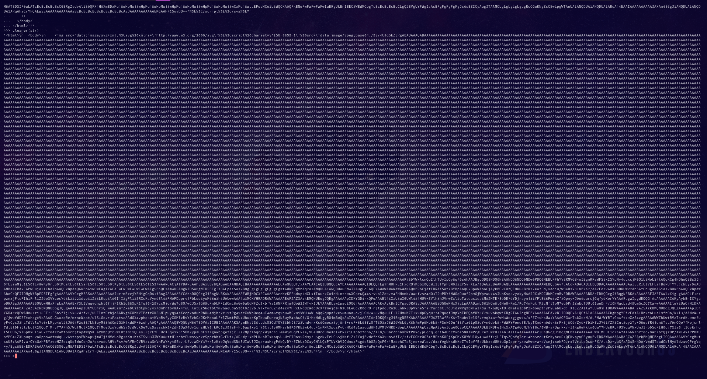

# Cross College Collage Competition

The page greets us with a text box where we have to submit HTML source code and the program will clean and pick out the image sources and create a beautiful collage.



Let's try and submit some HTML source code and see what happens



Checking out the source code we come across some of the modules being used in the app and their versions. On looking up these modules, we notice that we can take advantage of certain vulnerabilities in lxml based on this [CVE-2021-43818](https://www.cve.org/CVERecord?id=CVE-2021-43818). Let us try to craft a payload using the following line

> The HTML Cleaner in `lxml.html` lets certain crafted script content
> pass through, **as well as script content in `SVG` files embedded using
> data Uris**

Let's first create the SVG file,

	<svg><script></script></svg>

Now we need to create a valid JPEG image that can perform XSS and embed it as a source into the SVG
```
 <svg><script src="jpegdatauri"></script></svg>
```
Take this SVG "image" and keep it in an image src tag
```
<html>
  <body>
	
  </body>
</html>
```
Now we can move on to crafting the JPEG image with the payload we could try editing the EXIF data and observing if anything happens however this is not the case as we get "remove EXIF data" in the response and even if it was passed the JavaScript does not execute

Let us try to find a different method we can use the method of injecting JavaScript in a JPEG as told in this article by [MEDUSA](https://infosecwriteups.com/exploiting-xss-with-javascript-jpeg-polyglot-4cff06f8201a).

The JavaScript executes and results in XSS.



Now we can write a custom payload using the above method to take the cookie that has the flag from the admin user.



A POC for the alert is given

*note the behavior of the cleaner is unusual when we clean the HTML with random strings in the src attribute it gets cleaned however when the JavaScript payload is put in it doesn't get cleaned 
images attached for the above



